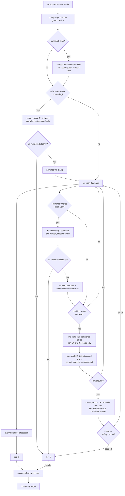

# nixos-postgres-maintenance-module

A NixOS module + CLI that closes
[nixpkgs#318777](https://github.com/NixOS/nixpkgs/issues/318777):
Postgres refuses to start once its on-disk collation library version no
longer matches what's recorded in its catalogs. This runs before
`postgresql.target` comes up, detects that drift, and repairs it —
reindexing affected relations, refreshing the recorded version, and
relocating any row that's drifted into the wrong text-keyed partition —
rather than leaving the cluster down until a human intervenes.

## Why this exists

PostgreSQL versions each collation it uses (`pg_database.datcollversion`,
`pg_collation.collversion`) so it can detect when the underlying
collation library (glibc, ICU) changed underneath it — a changed sort
order silently corrupts indexes and can misplace rows in a
collation-keyed partitioned table. Nixpkgs itself declined to fix this
at the distribution level (`nixpkgs#318777`, closed won't-fix: "there's
nothing we can do" absent a proper mechanism). This project is that
mechanism, packaged so any NixOS host running Postgres can use it.

`C`/`C.*`/`POSIX` locales are a separate problem: Postgres never
records a version for them at all, so a glibc upgrade that changes
`C.UTF-8`'s own behavior (it has happened — glibc 2.35, 2022) is
otherwise invisible. This project tracks that separately via a stamp —
see `docs/decisions/0003-store-path-not-version-string-for-the-c-utf-8-stamp.md`.

## How it works



A single relation/row failure never blocks the rest: every reindex and
every repair is isolated per-relation so one bad index or one
unrepairable row doesn't stop the whole run from fixing everything else
(see `docs/decisions/0002-per-relation-not-per-database-reindex.md`) —
but *any* failure anywhere still fails the overall run loudly, which
blocks `postgresql-setup.service` and `postgresql.target`. That's
deliberate: a reindex or repair failure is almost always a real
constraint violation that needs a human decision, not something safe to
silently skip past.

## Usage

```nix
{
  inputs.nixos-postgres-maintenance-module.url = "github:dvaerum/nixos-postgres-maintenance-module";

  # in your NixOS configuration:
  imports = [ inputs.nixos-postgres-maintenance-module.nixosModules.default ];
  services.postgresqlCollationGuard.enable = true;
}
```

See `docs/options.md` (generated via `generate-doc.nix`) for the full
option reference, or `nixosModule/options.nix` directly.

### Hooks

`services.postgresqlCollationGuard.hooks.{preStart,onSuccess,onFailure,postRun}`
each take a list of packages run at the corresponding stage (e.g. to
take a pre-run backup, alert on-call on failure, or emit a metric
regardless of outcome). Each hook is invoked as `<exe> <stage>`; JSON
run context is passed via the `COLLATION_GUARD_CONTEXT_FILE` path set
in the hook's environment. See `nixosModule/options.nix` for the exact
JSON shape per stage.

### CLI

```
collation-guard           # the real run -- reads PGHOST/PGPORT/GLIBC_LOCALES_PATH/
                           # COLLATION_GUARD_* from the environment, as the systemd unit sets them
collation-guard --dry-run # list partition-repair candidates across the cluster, change nothing
```

## Known limitations

- **ICU's `collversion` doesn't always change when behavior does.**
  ICU 72→73 changed root-collation sort order for 331+ locales without
  bumping `collversion` (ICU-22544) — this guard's entire
  Postgres-tracked detection mechanism has a blind spot specific to ICU
  collations as a result. Not fixable without a full data
  re-verification regardless of version match (a much bigger, different
  feature); documented as an accepted gap. Only relevant if a consumer
  uses the `icu` provider.
- **Partition repair assumes exclusive access to the cluster.** It runs
  in the pre-boot window before `postgresql-setup`/`postgresql.target`
  activate, so no application ever has a connection open yet in the
  normal case — but a documented, still-open PG deadlock pattern exists
  if this module is ever invoked against an already-live cluster with
  concurrent writers.
- **No real-drift test coverage for row-level partition repair.** A
  genuinely misplaced row only exists because the same collation's
  comparison behavior changed between validation time and now (an
  actual glibc/ICU version change) — not reproducible in a
  single-locale test sandbox. See
  `docs/learnings/partition-repair-testing.md` for what was tried and
  why; the test suite instead proves the mechanism's load-bearing parts
  separately.

See `docs/decisions/` for the full reasoning behind each piece, and
`docs/learnings/` for other non-obvious findings from building this.

## Future work

- **Blocking external (non-systemd-managed) clients during the run.**
  `postgresql-setup.service`/`postgresql.target` and anything ordered
  after them on *this* host correctly wait for the guard, but a client
  connecting from somewhere else entirely -- another host on the
  network, anything outside this host's own systemd dependency graph --
  has no reason to wait and can connect while the guard is still
  reindexing or mid-repair, against inconsistent state. Not designed or
  implemented yet; no clear mechanism chosen (candidates to look into:
  temporarily tightening `pg_hba.conf`, a connection-limiting setting,
  or some way to advertise "still under maintenance" that external
  tooling could check) -- flagged here as a real gap worth solving, not
  solved.

## Development

```
nix develop         # python3, psycopg, pytest, ruff, mypy, postgresql on PATH
pytest               # fast tier: logic tests against an ephemeral initdb/pg_ctl cluster
nix flake check      # fast tier + slow (systemd-nspawn) tier + the Nix package build
nix fmt              # format both Nix and Python
nix-build generate-doc.nix && cp result docs/options.md   # regenerate the option reference
```

See `AGENTS.md` for the full contributor/agent workflow, including the
versioning policy.

## Documentation

- `docs/decisions/` — one ADR per real design decision, with sources.
- `docs/learnings/` — cross-cutting operational knowledge (known
  limitations, gotchas) not tied to a single decision.
- `docs/options.md` — generated NixOS option reference.
