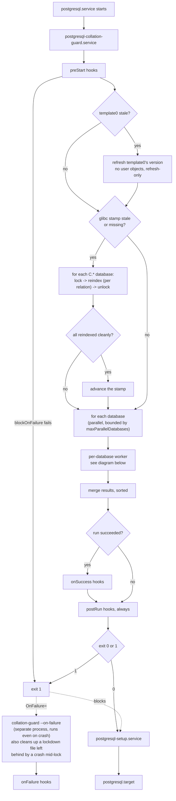
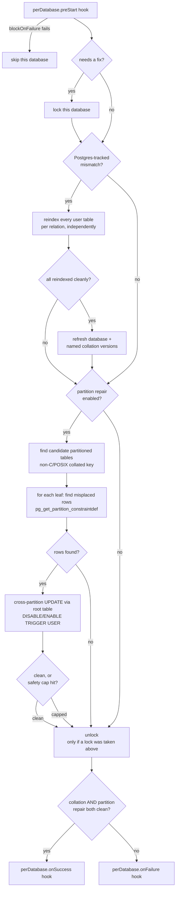

# nixos-postgres-maintenance-module

A NixOS module + CLI that closes
[nixpkgs#318777](https://github.com/NixOS/nixpkgs/issues/318777):
Postgres refuses to start once its on-disk collation library version no
longer matches what's recorded in its catalogs. This runs before
`postgresql.target` comes up, detects that drift, and repairs it —
reindexing affected relations, refreshing the recorded version, and
relocating any row that's drifted into the wrong text-keyed partition —
rather than leaving the cluster down until a human intervenes.

## Why this exists

PostgreSQL versions each collation it uses (`pg_database.datcollversion`,
`pg_collation.collversion`) so it can detect when the underlying
collation library (glibc, ICU) changed underneath it — a changed sort
order silently corrupts indexes and can misplace rows in a
collation-keyed partitioned table. Nixpkgs itself declined to fix this
at the distribution level (`nixpkgs#318777`, closed won't-fix: "there's
nothing we can do" absent a proper mechanism). This project is that
mechanism, packaged so any NixOS host running Postgres can use it.

`C`/`C.*`/`POSIX` locales are a separate problem: Postgres never
records a version for them at all, so a glibc upgrade that changes
`C.UTF-8`'s own behavior (it has happened — glibc 2.35, 2022) is
otherwise invisible. This project tracks that separately via a stamp —
see `docs/decisions/0003-store-path-not-version-string-for-the-c-utf-8-stamp.md`.

## How it works

Two diagrams, one flow: the first is the top-level run, start to exit —
the glibc/`C.*` phase, then fanning out into one worker per database. The
"per-database worker" box in the middle of it is where that fan-out
happens; the second diagram is what each of those workers actually does,
expanded out separately so it fits on screen.

### Top-level orchestration



### Per-database worker

This expands the "per-database worker" box from the diagram above. One
instance of this flow runs per database, independently and concurrently,
bounded by `maxParallelDatabases`:



A single relation/row failure never blocks the rest: every reindex and
every repair is isolated per-relation so one bad index or one
unrepairable row doesn't stop the whole run from fixing everything else
(see `docs/decisions/0002-per-relation-not-per-database-reindex.md`) —
but *any* failure anywhere still fails the overall run loudly, which
blocks `postgresql-setup.service` and `postgresql.target`. That's
deliberate: a reindex or repair failure is almost always a real
constraint violation that needs a human decision, not something safe to
silently skip past.

Databases are processed concurrently, bounded by
`services.postgresqlCollationGuard.maxParallelDatabases` (default 4) —
the work is I/O-bound (waiting on Postgres over a socket), so this cuts
boot time on a multi-database cluster without needing to raise it
further; see `docs/decisions/0006-hooks-and-parallel-per-database-processing.md`
for why it's bounded rather than unbounded.

Postgres itself is already accepting connections by the time this
guard runs (`postgresql.service` is `Type=notify`, and only reports
ready once it's listening) — anything not ordered after
`postgresql-setup.service`/`postgresql.target` could otherwise connect
mid-REINDEX or mid-repair, against inconsistent state. By default
(`services.postgresqlCollationGuard.connectionLockdown.enable = true`),
each database is rejected for new connections — and has any
already-open session terminated — for exactly the duration it's
actively being worked on, and only if it actually needs a fix; see
`docs/decisions/0007-connection-lockdown-during-repair.md`.

## Usage

```nix
{
  inputs.nixos-postgres-maintenance-module.url = "github:dvaerum/nixos-postgres-maintenance-module";

  # in your NixOS configuration:
  imports = [ inputs.nixos-postgres-maintenance-module.nixosModules.default ];
  services.postgresqlCollationGuard.enable = true;
}
```

See `docs/options.md` (generated via `generate-doc.nix`) for the full
option reference, or `nixosModule/options.nix` directly. See
`examples/` for a working, tested set of scenarios (tuning,
`connectionLockdown`/`partitionRepair` opt-out, a `preStart` hook that
aborts the run, a `perDatabase.onFailure` hook, and the whole-run
`onFailure` hook) -- each one is exercised by a `tests/nixos/*.nix`
check, so a renamed/removed option breaks CI, not just the docs.

### Hooks

Seven hook points, all sharing the same shape -- the original four,
whole-run hooks (`preStart`, `onSuccess`, `onFailure`, `postRun`), plus
a `perDatabase.{preStart,onSuccess,onFailure}` tier that knows which
database it's about:

```nix
services.postgresqlCollationGuard.hooks.perDatabase.onFailure = [
  {
    path = lib.getExe pkgs.curl;
    args = [ "-X" "POST" "https://hooks.example.com/notify" "-d" "@-" ];
    environmentFile = config.sops.secrets."notify-webhook-token".path;
    blockOnFailure = false; # must be set explicitly -- no default
  }
];
```

Every hook gets `COLLATION_GUARD_STAGE` (always), `COLLATION_GUARD_DATABASE`
(the three `database_*` stages), `COLLATION_GUARD_ERROR` (a plain
one-line summary, no JSON parsing needed, on failure-shaped stages),
and `COLLATION_GUARD_CONTEXT` — always present, always valid JSON, on
every single stage (an empty `{}` where there's nothing yet to report,
e.g. `perDatabase.preStart`) — no need to check whether it exists
before parsing it. `environmentFile` and inline `environment` merge
with those -- any variable name defined by more than one source is a
hard error (`EnvironmentCollisionError`) before the hook ever runs,
never a silent override.

`blockOnFailure` always does something real and specific to that hook
point (abort the run, skip one database, add a failure that can flip
an otherwise-clean exit code, or -- for `onFailure` -- make the
companion systemd unit itself report failed status) -- see
`docs/decisions/0006-hooks-and-parallel-per-database-processing.md`
for the full table. `onFailure` is triggered by systemd's `OnFailure=`
(the one guarantee that survives the guard process being killed or
crashing outright), but the hooks themselves run through the exact
same mechanism as every other stage, from a second `collation-guard
--on-failure` entry point into the same binary.

### Connection lockdown

```nix
services.postgresqlCollationGuard.connectionLockdown.enable = false; # default true
```

Default `true` -- see the explanation above and
`docs/decisions/0007-connection-lockdown-during-repair.md`. Turn it off
only if there's a specific reason to allow concurrent connections
during the guard's run.

### CLI

```
collation-guard           # the real run -- reads PGHOST/PGPORT/GLIBC_LOCALES_PATH/
                           # COLLATION_GUARD_* from the environment, as the systemd unit sets them
collation-guard --dry-run # list partition-repair candidates across the cluster, change nothing
```

## Known limitations

- **ICU's `collversion` doesn't always change when behavior does.**
  ICU 72→73 changed root-collation sort order for 331+ locales without
  bumping `collversion` (ICU-22544) — this guard's entire
  Postgres-tracked detection mechanism has a blind spot specific to ICU
  collations as a result. Not fixable without a full data
  re-verification regardless of version match (a much bigger, different
  feature); documented as an accepted gap. Only relevant if a consumer
  uses the `icu` provider.
- **Partition repair assumed exclusive access to the cluster; closed by
  connection lockdown.** It runs in the pre-boot window before
  `postgresql-setup`/`postgresql.target` activate, so no application
  ever has a connection open yet in the normal case — and for anything
  that doesn't follow that ordering (a cron job, a manually-run `psql`,
  a service only `Wants=`-ing Postgres), `connectionLockdown` (default
  `true`) now rejects new connections and terminates any already-open
  session on a database before work on it begins; see
  `docs/decisions/0007-connection-lockdown-during-repair.md`.
- **No real-drift test coverage for row-level partition repair under
  glibc.** Closed for ICU by `tests/nixos/icu-drift.nix`
  (`docs/decisions/0008-icu-drift-test.md`); still open for glibc. See
  0008's "Why ICU, not glibc" and
  `docs/learnings/partition-repair-testing.md` for the full mechanism
  and reasoning.

See `docs/decisions/` for the full reasoning behind each piece, and
`docs/learnings/` for other non-obvious findings from building this.

## Development

```
nix develop         # python3, psycopg, pytest, ruff, mypy, postgresql on PATH
pytest               # fast tier: logic tests against an ephemeral initdb/pg_ctl cluster
nix flake check      # fast tier + slow (systemd-nspawn) tier + the Nix package build
nix build .#icuDriftTest -L   # heaviest tier: real ICU-drift test, two full Postgres
                               # rebuilds -- not part of `nix flake check`/CI, see
                               # docs/decisions/0008; run by hand only
nix fmt              # format Nix files (nixfmt-rfc-style) -- no Python formatter is wired in
nix-build generate-doc.nix && cp result docs/options.md   # regenerate the option reference
```

See `AGENTS.md` for the full contributor/agent workflow, including the
versioning policy.

## Documentation

- `docs/decisions/` — one ADR per real design decision, with sources.
- `docs/learnings/` — cross-cutting operational knowledge (known
  limitations, gotchas) not tied to a single decision.
- `docs/options.md` — generated NixOS option reference.
